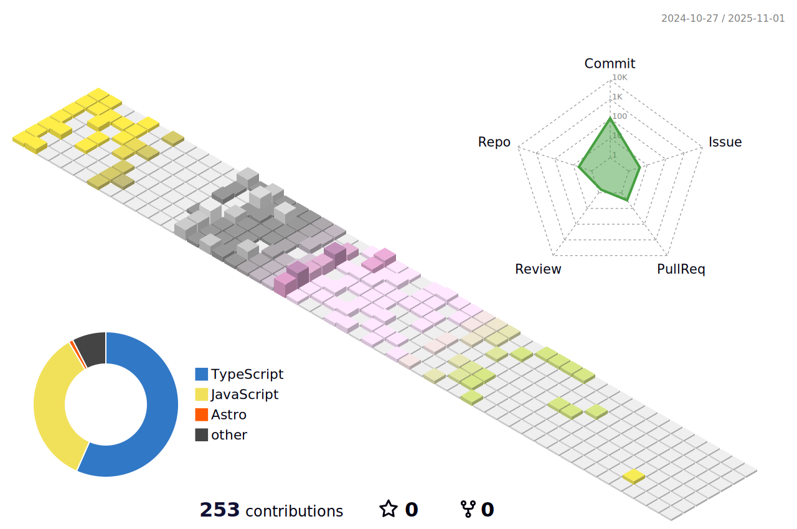

### Olá! Eu sou o Rafael Lima!
### Bem-vindo ao meu perfil github :books:
### Caso queira entrar em contato comigo:

 
  
  

---

### Linguagens e frameworks que já tenho um certo domínio:

 
  
  
  
  
   
   
  

---
### O que eu estou estudando:

 
   
   
  

---

### Tenho interesse em aprender:

 

  
  

---
  

---
