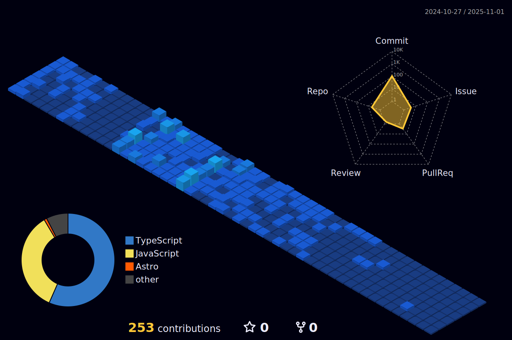

<h1 align="center"> Olá! Eu sou o Rafael Lima!👋 </h1>

 
Bem-vindo ao meu perfil github! Sou um Desenvolvedor Web, apaixonado por aprender e por Tecnologia, estou constantemente em busca de aprimorar meus conhecimentos e ter muitas experiências. Sou organizado, persistente e sempre disponível para ajudar ou aprender algo novo. 

- :zap: Linguagens, frameworks e bibliotecas que já tenho um certo domínio:
  
  
  
  
  
   
   
  ######
- :books: O que eu estou estudando:
  
   
   
  
  
  ######
- 💡 Tenho interesse em aprender:
  
  
  
  ######

  Para entrar em contato comigo: 

  

---

---
